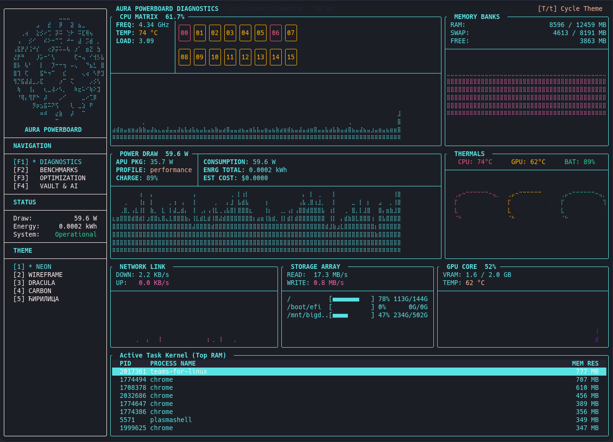
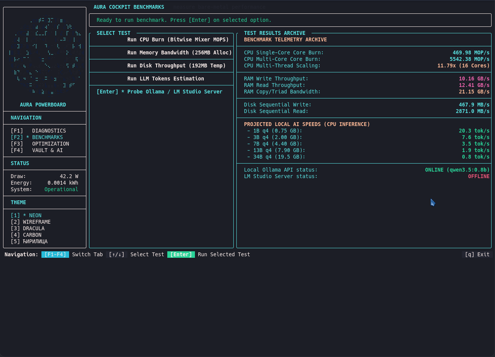
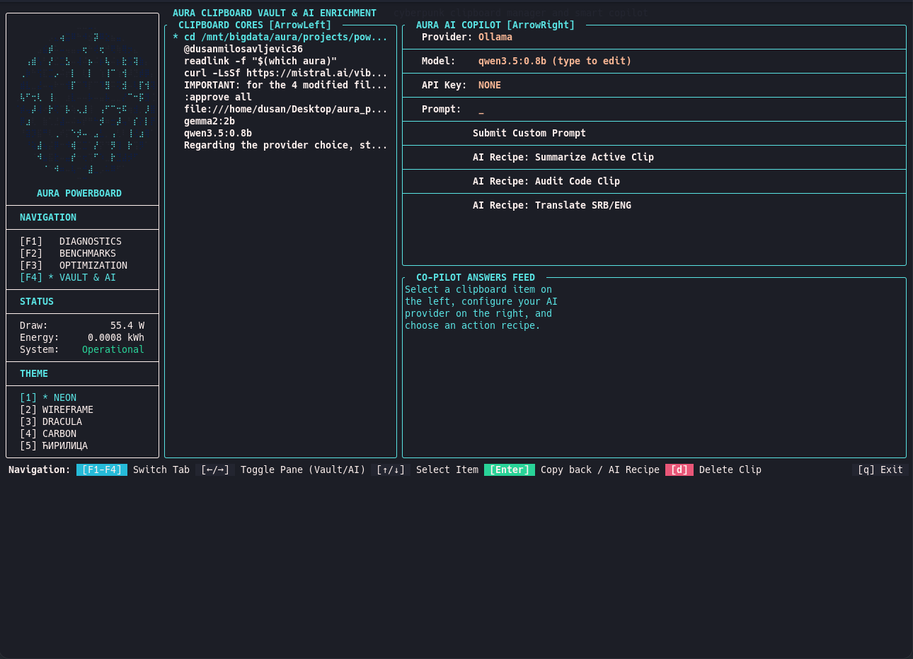

# powerboard

> C++20 terminal GPU power monitor with full system telemetry — btop++ style.


Powerboard is a real-time hardware monitor for Linux. It samples **GPU power consumption**, **CPU load & temp**, **RAM usage**, **disk usage**, and **system uptime** every 100 ms, and renders everything at smooth 60 FPS in your terminal.

## Features

- ⚡ **GPU power tracking** — reads NVIDIA/AMD power sensors via sysfs, integrates cumulative kWh and cost
- 💻 **CPU** — load % and temperature (coretemp/k10temp/zenpower)
- 🎮 **GPU** — load %, temperature, and power draw
- 🧠 **RAM** — used / total GB with live sparkline
- 💾 **Disk** — used / total GB for root (`/`) with live sparkline
- ⏱ **Uptime** — days, hours, minutes, seconds
- 📈 **Braille power graph** — overlapping traces for W, kWh, and cost over the last 5 minutes
- 💾 **CSV logging** — auto-rotating monthly files for historical analysis
- ⌨️ **Vim-like command bar** — `:q`, `:help`, `:graph`

## Screenshots

### Diagnostics Dashboard



### Benchmarks



### Vault & AI Enrichment




## Installation

### Prerequisites

- Linux with `sysfs` (`/sys/class/hwmon`, `/sys/class/drm`, `/proc/stat`)
- C++20 compiler (GCC 11+ or Clang 14+)
- [vcpkg](https://github.com/microsoft/vcpkg) (C++ package manager)
- CMake 3.22+

### Build

```bash
# Clone
git clone https://github.com/milodule3-debug/powerboard.git
cd powerboard

# Configure with vcpkg
mkdir build && cd build
cmake .. -DCMAKE_TOOLCHAIN_FILE=/path/to/vcpkg/scripts/buildsystems/vcpkg.cmake

# Build
make -j$(nproc)

# Run
./powerboard
```

## Usage

Run directly in a terminal:

```bash
./powerboard
```

### Commands

| Key / Command | Action |
|--------------|--------|
| `:q` or `:quit` | Exit powerboard |
| `:help` | Show help overlay |
| `:graph` | Toggle graph size (large / normal) |
| `Esc` | Exit help / cancel command / shrink graph |
| `q` | Quick quit (normal mode) |

### Data logging

Powerboard automatically writes CSV logs to `./powerboard_YYYY-MM.csv`:

```
timestamp,power_w,cumulative_kwh,cost_usd
2026-07-10T12:58:49,11.042,3.82076e-05,5.73114e-06
```

Files rotate monthly.

## Architecture

```
┌─────────────┐     ┌──────────────┐     ┌─────────────┐
│  Sampler    │────▶│  Metrics     │◀────│  UI Render  │
│  (100 Hz)   │     │  (mutex)     │     │  (60 FPS)   │
└─────────────┘     └──────────────┘     └─────────────┘
       │                                        │
       ▼                                        ▼
  /proc/stat                                 FTXUI
  /sys/class/hwmon                     Fullscreen TUI
  /sys/class/drm
  /proc/meminfo
  statvfs("/")
```

- **Thread 1**: Hardware sampler — reads sysfs/procfs every 100 ms
- **Thread 2**: UI refresh — posts to FTXUI every ~16 ms for smooth rendering
- **Thread 3**: CSV logger — writes to disk every 10 s

## Metrics

| Metric | Source | Resolution |
|--------|--------|------------|
| CPU load | `/proc/stat` (delta) | 0.01% |
| CPU temp | `hwmon` (coretemp/k10temp) | 0.5°C |
| GPU load | DRM `gpu_busy_percent` | 0.1% |
| GPU temp | GPU hwmon | 0.5°C |
| GPU power | GPU hwmon `power1_average` | 1 µW |
| RAM | `/proc/meminfo` | 1 KB |
| Disk | `statvfs("/")` | 1 B |
| Uptime | `/proc/uptime` | 0.01 s |

## License

MIT
